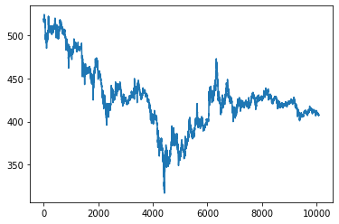
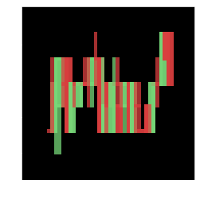

# Deep_learning_models_for_Dogecoin_price_prediction

# 캔들차트 데이터 생성


참고 : https://dataplay.tistory.com/37?category=845492

참고코드 : https://colab.research.google.com/drive/1WXG3cohwO6_0mbmB9CdT37cc1jfE2Zon


```python
pip install mpl_finance
```

    Collecting mpl_finance
      Downloading https://files.pythonhosted.org/packages/9d/de/8169ea4403d6cb8322e74cc48b6834d1dfbed81931d17f1f26b2140160d8/mpl_finance-0.10.1-py3-none-any.whl
    Requirement already satisfied: matplotlib in /usr/local/lib/python3.7/dist-packages (from mpl_finance) (3.2.2)
    Requirement already satisfied: cycler>=0.10 in /usr/local/lib/python3.7/dist-packages (from matplotlib->mpl_finance) (0.10.0)
    Requirement already satisfied: python-dateutil>=2.1 in /usr/local/lib/python3.7/dist-packages (from matplotlib->mpl_finance) (2.8.1)
    Requirement already satisfied: kiwisolver>=1.0.1 in /usr/local/lib/python3.7/dist-packages (from matplotlib->mpl_finance) (1.3.1)
    Requirement already satisfied: pyparsing!=2.0.4,!=2.1.2,!=2.1.6,>=2.0.1 in /usr/local/lib/python3.7/dist-packages (from matplotlib->mpl_finance) (2.4.7)
    Requirement already satisfied: numpy>=1.11 in /usr/local/lib/python3.7/dist-packages (from matplotlib->mpl_finance) (1.19.5)
    Requirement already satisfied: six in /usr/local/lib/python3.7/dist-packages (from cycler>=0.10->matplotlib->mpl_finance) (1.15.0)
    Installing collected packages: mpl-finance
    Successfully installed mpl-finance-0.10.1


```python
import os
import pandas as pd
import numpy as np
import matplotlib.pyplot as plt
from pathlib import Path
from shutil import copyfile, move
from mpl_finance import candlestick2_ochl
```

도지 코인 파일 불러오기


```python
from google.colab import drive
drive.mount('/content/drive/')
```

    Mounted at /content/drive/


```python
import os
currentPath = os.getcwd()

#change path
os.chdir('/content/drive/MyDrive')
```


```python
coinbase = pd.read_csv("out_KRW-DOGE_min_1_2021-05-21.csv")

cb_index = coinbase.index.ravel() # 메모리에서 발생하는 순서대로 인덱싱하여 평평하게 배열

coinbase
```


<div>
<style scoped>
    .dataframe tbody tr th:only-of-type {
        vertical-align: middle;
    }

    .dataframe tbody tr th {
        vertical-align: top;
    }

    .dataframe thead th {
        text-align: right;
    }
</style>
<table border="1" class="dataframe">
  <thead>
    <tr style="text-align: right;">
      <th></th>
      <th>code</th>
      <th>candleDateTime</th>
      <th>candleDateTimeKst</th>
      <th>openingPrice</th>
      <th>highPrice</th>
      <th>lowPrice</th>
      <th>tradePrice</th>
      <th>candleAccTradeVolume</th>
      <th>candleAccTradePrice</th>
      <th>timestamp</th>
      <th>unit</th>
    </tr>
  </thead>
  <tbody>
    <tr>
      <th>0</th>
      <td>CRIX.UPBIT.KRW-DOGE</td>
      <td>2021-05-20T15:00:00+00:00</td>
      <td>2021-05-21T00:00:00+09:00</td>
      <td>516</td>
      <td>517</td>
      <td>515</td>
      <td>516</td>
      <td>2.901292e+06</td>
      <td>1.498517e+09</td>
      <td>1.621520e+12</td>
      <td>1</td>
    </tr>
    <tr>
      <th>1</th>
      <td>CRIX.UPBIT.KRW-DOGE</td>
      <td>2021-05-20T15:01:00+00:00</td>
      <td>2021-05-21T00:01:00+09:00</td>
      <td>517</td>
      <td>517</td>
      <td>515</td>
      <td>517</td>
      <td>2.739025e+06</td>
      <td>1.413013e+09</td>
      <td>1.621520e+12</td>
      <td>1</td>
    </tr>
    <tr>
      <th>2</th>
      <td>CRIX.UPBIT.KRW-DOGE</td>
      <td>2021-05-20T15:02:00+00:00</td>
      <td>2021-05-21T00:02:00+09:00</td>
      <td>516</td>
      <td>518</td>
      <td>516</td>
      <td>517</td>
      <td>3.068264e+06</td>
      <td>1.585857e+09</td>
      <td>1.621520e+12</td>
      <td>1</td>
    </tr>
    <tr>
      <th>3</th>
      <td>CRIX.UPBIT.KRW-DOGE</td>
      <td>2021-05-20T15:03:00+00:00</td>
      <td>2021-05-21T00:03:00+09:00</td>
      <td>517</td>
      <td>519</td>
      <td>517</td>
      <td>518</td>
      <td>3.167764e+06</td>
      <td>1.642005e+09</td>
      <td>1.621520e+12</td>
      <td>1</td>
    </tr>
    <tr>
      <th>4</th>
      <td>CRIX.UPBIT.KRW-DOGE</td>
      <td>2021-05-20T15:04:00+00:00</td>
      <td>2021-05-21T00:04:00+09:00</td>
      <td>519</td>
      <td>520</td>
      <td>517</td>
      <td>518</td>
      <td>4.111393e+06</td>
      <td>2.131710e+09</td>
      <td>1.621520e+12</td>
      <td>1</td>
    </tr>
    <tr>
      <th>...</th>
      <td>...</td>
      <td>...</td>
      <td>...</td>
      <td>...</td>
      <td>...</td>
      <td>...</td>
      <td>...</td>
      <td>...</td>
      <td>...</td>
      <td>...</td>
      <td>...</td>
    </tr>
    <tr>
      <th>10075</th>
      <td>CRIX.UPBIT.KRW-DOGE</td>
      <td>2021-05-27T14:55:00+00:00</td>
      <td>2021-05-27T23:55:00+09:00</td>
      <td>408</td>
      <td>409</td>
      <td>408</td>
      <td>408</td>
      <td>3.265581e+05</td>
      <td>1.332449e+08</td>
      <td>1.622130e+12</td>
      <td>1</td>
    </tr>
    <tr>
      <th>10076</th>
      <td>CRIX.UPBIT.KRW-DOGE</td>
      <td>2021-05-27T14:56:00+00:00</td>
      <td>2021-05-27T23:56:00+09:00</td>
      <td>408</td>
      <td>409</td>
      <td>408</td>
      <td>408</td>
      <td>6.259779e+05</td>
      <td>2.554018e+08</td>
      <td>1.622130e+12</td>
      <td>1</td>
    </tr>
    <tr>
      <th>10077</th>
      <td>CRIX.UPBIT.KRW-DOGE</td>
      <td>2021-05-27T14:57:00+00:00</td>
      <td>2021-05-27T23:57:00+09:00</td>
      <td>408</td>
      <td>408</td>
      <td>407</td>
      <td>408</td>
      <td>6.565523e+05</td>
      <td>2.678439e+08</td>
      <td>1.622130e+12</td>
      <td>1</td>
    </tr>
    <tr>
      <th>10078</th>
      <td>CRIX.UPBIT.KRW-DOGE</td>
      <td>2021-05-27T14:58:00+00:00</td>
      <td>2021-05-27T23:58:00+09:00</td>
      <td>408</td>
      <td>408</td>
      <td>407</td>
      <td>407</td>
      <td>3.526589e+05</td>
      <td>1.438332e+08</td>
      <td>1.622130e+12</td>
      <td>1</td>
    </tr>
    <tr>
      <th>10079</th>
      <td>CRIX.UPBIT.KRW-DOGE</td>
      <td>2021-05-27T14:59:00+00:00</td>
      <td>2021-05-27T23:59:00+09:00</td>
      <td>408</td>
      <td>408</td>
      <td>407</td>
      <td>408</td>
      <td>2.936084e+05</td>
      <td>1.197722e+08</td>
      <td>1.622130e+12</td>
      <td>1</td>
    </tr>
  </tbody>
</table>
<p>10080 rows × 11 columns</p>
</div>


```python
coinbase.isna().sum()
```


    code                    0
    candleDateTime          0
    candleDateTimeKst       0
    openingPrice            0
    highPrice               0
    lowPrice                0
    tradePrice              0
    candleAccTradeVolume    0
    candleAccTradePrice     0
    timestamp               0
    unit                    0
    dtype: int64


```python
data = coinbase.fillna(method="backfill") # 결측치를 뒷방향으로 채워나가는 것
```


```python
data = data.drop(columns=['code', 'candleDateTime', 'candleDateTimeKst', 'candleAccTradeVolume','candleAccTradePrice','timestamp','unit'], axis=1)
```


```python
data = data.reset_index(drop=True)
```


```python
data
```


<div>
<style scoped>
    .dataframe tbody tr th:only-of-type {
        vertical-align: middle;
    }

    .dataframe tbody tr th {
        vertical-align: top;
    }

    .dataframe thead th {
        text-align: right;
    }
</style>
<table border="1" class="dataframe">
  <thead>
    <tr style="text-align: right;">
      <th></th>
      <th>openingPrice</th>
      <th>highPrice</th>
      <th>lowPrice</th>
      <th>tradePrice</th>
    </tr>
  </thead>
  <tbody>
    <tr>
      <th>0</th>
      <td>516</td>
      <td>517</td>
      <td>515</td>
      <td>516</td>
    </tr>
    <tr>
      <th>1</th>
      <td>517</td>
      <td>517</td>
      <td>515</td>
      <td>517</td>
    </tr>
    <tr>
      <th>2</th>
      <td>516</td>
      <td>518</td>
      <td>516</td>
      <td>517</td>
    </tr>
    <tr>
      <th>3</th>
      <td>517</td>
      <td>519</td>
      <td>517</td>
      <td>518</td>
    </tr>
    <tr>
      <th>4</th>
      <td>519</td>
      <td>520</td>
      <td>517</td>
      <td>518</td>
    </tr>
    <tr>
      <th>...</th>
      <td>...</td>
      <td>...</td>
      <td>...</td>
      <td>...</td>
    </tr>
    <tr>
      <th>10075</th>
      <td>408</td>
      <td>409</td>
      <td>408</td>
      <td>408</td>
    </tr>
    <tr>
      <th>10076</th>
      <td>408</td>
      <td>409</td>
      <td>408</td>
      <td>408</td>
    </tr>
    <tr>
      <th>10077</th>
      <td>408</td>
      <td>408</td>
      <td>407</td>
      <td>408</td>
    </tr>
    <tr>
      <th>10078</th>
      <td>408</td>
      <td>408</td>
      <td>407</td>
      <td>407</td>
    </tr>
    <tr>
      <th>10079</th>
      <td>408</td>
      <td>408</td>
      <td>407</td>
      <td>408</td>
    </tr>
  </tbody>
</table>
<p>10080 rows × 4 columns</p>
</div>


```python
plt.plot(data['tradePrice'])
```


    [<matplotlib.lines.Line2D at 0x7fbe28ead350>]


    

    


```python
def ohlc2cs2(data, seq_len, dimension):
    # python preprocess.py -m ohlc2cs -l 20 -i stockdatas/EWT_testing.csv -t testing
    print("Converting olhc to candlestick")
    df = data
    plt.style.use('dark_background')
    figs = np.zeros((len(df)-1, dimension, dimension, 3))
    labels = []
    for i in range(0, len(df)-1):
        # ohlc+volume
        c = df.loc[i:i + int(seq_len) - 1, :]
        c_ = df.loc[i:i + int(seq_len), :]
        if len(c) == int(seq_len):
            my_dpi = 96
            fig = plt.figure(figsize=(dimension / my_dpi,
                                      dimension / my_dpi), dpi=my_dpi)
            ax1 = fig.add_subplot(1, 1, 1)
            candlestick2_ochl(ax1, c['openingPrice'], c['tradePrice'], c['highPrice'],
                              c['lowPrice'], width=1,
                              colorup='#77d879', colordown='#db3f3f')
            ax1.grid(False)
            ax1.set_xticklabels([])
            ax1.set_yticklabels([])
            ax1.xaxis.set_visible(False)
            ax1.yaxis.set_visible(False)
            ax1.axis('off')

            # create the second axis for the volume bar-plot
            # Add a seconds axis for the volume overlay

        starting = c_["tradePrice"].iloc[-2]
        endvalue = c_["tradePrice"].iloc[-1]
        if endvalue > starting :
            label = 1
        else :
            label = 0
        labels.append(label)

        fig.canvas.draw()
        fig_np = np.array(fig.canvas.renderer._renderer)
        figs[i] = fig_np[:,:,:3]

        plt.close(fig)
        # normal length - end

    print("Converting olhc to candlestik finished.")
    return figs, labels
```


```python
inputs = data
seq_len = 30
dimension = 48

figures, labels = ohlc2cs2(inputs, seq_len, dimension)
```

    Converting olhc to candlestick
    Converting olhc to candlestik finished.


```python
#위 함수로 생성된 figures는 값의 범위가 0~255 이기 때문에 0~1로 맞춰주기 위해 255로 나눕니다.
figures = figures/255.0
print(np.shape(labels), np.shape(figures))
```

    (10079,) (10079, 48, 48, 3)


데이터 제너레이팅


```python
def single_stock_generator(chart, labels, batch_size) :
    #output [chart, labels]
    while True :
        stock_batch = np.zeros(shape=(batch_size, dimension, dimension, 3))
        label_batch = np.zeros(shape=(batch_size, ))
        for i in range(batch_size) :
            idx = np.random.randint(len(labels))
            stock_batch[i] = chart[idx]
            label_batch[i] = labels[idx]

        yield stock_batch, label_batch
```


```python
train_len = 6753
batch_size = 16
train_gen = single_stock_generator(figures[:train_len], labels[:train_len], batch_size)
test_gen = single_stock_generator(figures[train_len:], labels[train_len:], batch_size)

```


```python
tmp_data = next(train_gen)
print("Chart image shape : ",np.shape(tmp_data[0]))
print("Label shape :",np.shape(tmp_data[1]))
```

    Chart image shape :  (16, 48, 48, 3)
    Label shape : (16,)


```python
# 만들어진 차트 이미지 중 하나를 예시로 그려보겠습니다.
import matplotlib as mpl
import matplotlib.pylab as plt
%matplotlib inline
```


```python
len(tmp_data[0][0][:,:,:])
```


    48


```python
plt.figure()
plt.imshow(tmp_data[0][15][:,:,:])
plt.show()
```


    

    


# 모듈, 라이브러리 설치


```python
# Keras의 Functional APi를 이용할 거라서 불러와줍니다.
import tensorflow as tf

from tensorflow import keras
from tensorflow.keras import layers
```


```python
from keras.models import Sequential
from keras.layers import Bidirectional
from keras.layers import LSTM
from keras.layers import Dense
from keras.layers import TimeDistributed

import numpy as np
import pandas as pd

from sklearn import preprocessing
from sklearn.model_selection import KFold, cross_val_score, cross_val_predict, GridSearchCV
from sklearn.tree import DecisionTreeClassifier
from sklearn.linear_model import LogisticRegression, Perceptron, SGDClassifier
from sklearn.neighbors import KNeighborsClassifier
from sklearn.naive_bayes import GaussianNB
from sklearn.svm import SVC, LinearSVC
from sklearn.ensemble import RandomForestClassifier , GradientBoostingClassifier
from sklearn.model_selection import StratifiedKFold
from sklearn.model_selection import train_test_split
from sklearn.feature_selection import RFECV
from sklearn.metrics import make_scorer, accuracy_score, classification_report, confusion_matrix, mean_squared_error

import matplotlib as mpl
import matplotlib.pyplot as plt
import matplotlib.pylab as pylab
import seaborn as sns
from pandas import get_dummies
import xgboost as xgb
import scipy
import math
import json
import sys
import csv
import os
import tqdm
import keras
from keras.models import Sequential
from keras.layers import Dense, LSTM, Dropout, GRU, Bidirectional
from keras.optimizers import SGD
from tqdm import tqdm_notebook


```


```python
from tensorflow.keras.models import Sequential
from tensorflow.keras.layers import Dense, LSTM, Conv1D, Lambda, ConvLSTM2D, Flatten
from tensorflow.keras.losses import Huber
from tensorflow.keras.optimizers import Adam
from tensorflow.keras.callbacks import EarlyStopping, ModelCheckpoint
```

# ANN


참고 코드 : https://colab.research.google.com/drive/1rIylR9RWEckndbyFNx1Wl_yUQZUF-wyI#scrollTo=70zNPAmbZcGh


```python
inputs = keras.Input(shape=(48, 48, 3))
x = inputs
x = layers.Flatten()(x)
x = layers.Dense(32, activation='relu')(x)
x = layers.Dense(1, activation='sigmoid')(x)
outputs = x

ANN = keras.Model(inputs, outputs)
ANN.summary()
```

    Model: "model_1"
    _________________________________________________________________
    Layer (type)                 Output Shape              Param #   
    =================================================================
    input_2 (InputLayer)         [(None, 48, 48, 3)]       0         
    _________________________________________________________________
    flatten_5 (Flatten)          (None, 6912)              0         
    _________________________________________________________________
    dense_2 (Dense)              (None, 32)                221216    
    _________________________________________________________________
    dense_3 (Dense)              (None, 1)                 33        
    =================================================================
    Total params: 221,249
    Trainable params: 221,249
    Non-trainable params: 0
    _________________________________________________________________


```python
#정확도
num_iters = train_len // batch_size
num_epochs = 11
optimizer = tf.keras.optimizers.Adam(0.0001)
loss_fn = tf.keras.losses.BinaryCrossentropy()
acc_fn = tf.keras.metrics.BinaryAccuracy()
num_test_iters = num_iters // 4

for epoch in range(num_epochs) :
    epoch_loss_avg = tf.keras.metrics.Mean()
    val_loss_avg = tf.keras.metrics.Mean()
    epoch_acc_avg = tf.keras.metrics.Mean()
    val_acc_avg = tf.keras.metrics.Mean()

    for iter in range(num_iters) :
        x_batch, y_batch = next(train_gen)
        y_batch = y_batch.reshape(-1,1)
        y_ = ANN(x_batch)
        loss_value = loss_fn(y_batch, y_)
        acc_value = acc_fn(y_batch, y_)
        epoch_loss_avg(loss_value)
        epoch_acc_avg(acc_value)

    for iter in range(num_test_iters) :
        x_batch, y_batch = next(test_gen)
        y_batch = y_batch.reshape(-1,1)
        y_= ANN(x_batch)
        loss_value2 = loss_fn(y_batch, y_)
        acc_value2 = acc_fn(y_batch, y_)
        val_loss_avg(loss_value2)
        val_acc_avg(acc_value2)


    print("Epoch {:03d}: , Train Loss: {:.5f} , Train acc: {:.5f}".format(epoch, epoch_loss_avg.result(), epoch_acc_avg.result()))
    print("Val_Loss: {:.3f}, Val_acc: {:.3f}".format(val_loss_avg.result(), val_acc_avg.result()))

ANN_loss = float(format(val_loss_avg.result()))
ANN_ACC = float(format(val_acc_avg.result()))
```

    Epoch 000: , Train Loss: 0.67184 , Train acc: 0.60964
    Val_Loss: 0.665, Val_acc: 0.608
    Epoch 001: , Train Loss: 0.67218 , Train acc: 0.61103
    Val_Loss: 0.667, Val_acc: 0.611
    Epoch 002: , Train Loss: 0.67363 , Train acc: 0.60831
    Val_Loss: 0.660, Val_acc: 0.609
    Epoch 003: , Train Loss: 0.67360 , Train acc: 0.60933
    Val_Loss: 0.663, Val_acc: 0.609
    Epoch 004: , Train Loss: 0.66941 , Train acc: 0.60983
    Val_Loss: 0.659, Val_acc: 0.610
    Epoch 005: , Train Loss: 0.67358 , Train acc: 0.61110
    Val_Loss: 0.662, Val_acc: 0.611
    Epoch 006: , Train Loss: 0.67089 , Train acc: 0.61145
    Val_Loss: 0.658, Val_acc: 0.612
    Epoch 007: , Train Loss: 0.67448 , Train acc: 0.61256
    Val_Loss: 0.660, Val_acc: 0.612
    Epoch 008: , Train Loss: 0.67347 , Train acc: 0.61236
    Val_Loss: 0.660, Val_acc: 0.612
    Epoch 009: , Train Loss: 0.67502 , Train acc: 0.61189
    Val_Loss: 0.665, Val_acc: 0.612
    Epoch 010: , Train Loss: 0.67178 , Train acc: 0.61178
    Val_Loss: 0.660, Val_acc: 0.612


```python
ANN_ACC
```


    0.6120555400848389


# 1D CNN


```python
inputs = keras.Input(shape=(48, 48, 3))
x = inputs
x = layers.Conv1D(filters=32, kernel_size=5, padding="causal",activation="relu")(x)
x = layers.Flatten()(x)
x = layers.Dense(16, activation="relu")(x)
x = layers.Dense(1, activation='sigmoid')(x)
outputs = x

CNN1D = keras.Model(inputs, outputs)
CNN1D.summary()
```

    Model: "model_2"
    _________________________________________________________________
    Layer (type)                 Output Shape              Param #   
    =================================================================
    input_3 (InputLayer)         [(None, 48, 48, 3)]       0         
    _________________________________________________________________
    conv1d (Conv1D)              (None, 48, 48, 32)        512       
    _________________________________________________________________
    flatten_6 (Flatten)          (None, 73728)             0         
    _________________________________________________________________
    dense_4 (Dense)              (None, 16)                1179664   
    _________________________________________________________________
    dense_5 (Dense)              (None, 1)                 17        
    =================================================================
    Total params: 1,180,193
    Trainable params: 1,180,193
    Non-trainable params: 0
    _________________________________________________________________


```python
#정확도
num_iters = train_len // batch_size
num_epochs = 11
optimizer = tf.keras.optimizers.Adam(0.0001)
loss_fn = tf.keras.losses.BinaryCrossentropy()
acc_fn = tf.keras.metrics.BinaryAccuracy()
num_test_iters = num_iters // 4
for epoch in range(num_epochs) :
    epoch_loss_avg = tf.keras.metrics.Mean()
    val_loss_avg = tf.keras.metrics.Mean()
    epoch_acc_avg = tf.keras.metrics.Mean()
    val_acc_avg = tf.keras.metrics.Mean()

    for iter in range(num_iters) :
        x_batch, y_batch = next(train_gen)
        y_batch = y_batch.reshape(-1,1)
        y_ = CNN1D(x_batch)
        loss_value = loss_fn(y_batch, y_)
        acc_value = acc_fn(y_batch, y_)
        epoch_loss_avg(loss_value)
        epoch_acc_avg(acc_value)

    for iter in range(num_test_iters) :
        x_batch, y_batch = next(test_gen)
        y_batch = y_batch.reshape(-1,1)
        y_= CNN1D(x_batch)
        loss_value2 = loss_fn(y_batch, y_)
        acc_value2 = acc_fn(y_batch, y_)
        val_loss_avg(loss_value2)
        val_acc_avg(acc_value2)


    print("Epoch {:03d}: , Train Loss: {:.5f} , Train acc: {:.5f}".format(epoch, epoch_loss_avg.result(), epoch_acc_avg.result()))
    print("Val_Loss: {:.3f}, Val_acc: {:.3f}".format(val_loss_avg.result(), val_acc_avg.result()))

CNN1D_loss = float(format(val_loss_avg.result()))
CNN1D_ACC = float(format(val_acc_avg.result()))
```

    Epoch 000: , Train Loss: 0.70311 , Train acc: 0.36974
    Val_Loss: 0.708, Val_acc: 0.360
    Epoch 001: , Train Loss: 0.70281 , Train acc: 0.35737
    Val_Loss: 0.708, Val_acc: 0.358
    Epoch 002: , Train Loss: 0.70412 , Train acc: 0.35578
    Val_Loss: 0.708, Val_acc: 0.354
    Epoch 003: , Train Loss: 0.70411 , Train acc: 0.35271
    Val_Loss: 0.708, Val_acc: 0.352
    Epoch 004: , Train Loss: 0.70353 , Train acc: 0.35079
    Val_Loss: 0.707, Val_acc: 0.351
    Epoch 005: , Train Loss: 0.70331 , Train acc: 0.35100
    Val_Loss: 0.708, Val_acc: 0.351
    Epoch 006: , Train Loss: 0.70350 , Train acc: 0.35082
    Val_Loss: 0.706, Val_acc: 0.352
    Epoch 007: , Train Loss: 0.70355 , Train acc: 0.35237
    Val_Loss: 0.708, Val_acc: 0.353
    Epoch 008: , Train Loss: 0.70370 , Train acc: 0.35237
    Val_Loss: 0.709, Val_acc: 0.352
    Epoch 009: , Train Loss: 0.70306 , Train acc: 0.35257
    Val_Loss: 0.708, Val_acc: 0.352
    Epoch 010: , Train Loss: 0.70348 , Train acc: 0.35233
    Val_Loss: 0.707, Val_acc: 0.353


```python
CNN1D_ACC
```


    0.35252845287323


# CNN

참고 논문 : Using Deep Learning Neural Networks and Candlestick chart Representation to Predict Stock Market
https://arxiv.org/pdf/1903.12258.pdf

다음날 종가가 상승이냐 아니냐를 맞추는 binary classification 문제


```python
inputs = keras.Input(shape=(48, 48, 3))
x = inputs
x = layers.Conv2D(48, 3, activation='relu', padding="same")(x)
x = layers.MaxPooling2D(2)(x)
x = layers.Dropout(rate=0.5)(x)
x = layers.Conv2D(96, 3, activation='relu', padding="same")(x)
x = layers.MaxPooling2D(2)(x)
x = layers.Dropout(rate=0.5)(x)
x = layers.Flatten()(x)
x = layers.Dense(1, activation='sigmoid')(x)
outputs = x

CNN = keras.Model(inputs, outputs)
CNN.summary()
```

    Model: "model_3"
    _________________________________________________________________
    Layer (type)                 Output Shape              Param #   
    =================================================================
    input_4 (InputLayer)         [(None, 48, 48, 3)]       0         
    _________________________________________________________________
    conv2d (Conv2D)              (None, 48, 48, 48)        1344      
    _________________________________________________________________
    max_pooling2d (MaxPooling2D) (None, 24, 24, 48)        0         
    _________________________________________________________________
    dropout (Dropout)            (None, 24, 24, 48)        0         
    _________________________________________________________________
    conv2d_1 (Conv2D)            (None, 24, 24, 96)        41568     
    _________________________________________________________________
    max_pooling2d_1 (MaxPooling2 (None, 12, 12, 96)        0         
    _________________________________________________________________
    dropout_1 (Dropout)          (None, 12, 12, 96)        0         
    _________________________________________________________________
    flatten_7 (Flatten)          (None, 13824)             0         
    _________________________________________________________________
    dense_6 (Dense)              (None, 1)                 13825     
    =================================================================
    Total params: 56,737
    Trainable params: 56,737
    Non-trainable params: 0
    _________________________________________________________________


```python
#정확도
num_iters = train_len // batch_size
num_epochs = 11
optimizer = tf.keras.optimizers.Adam(0.0001)
loss_fn = tf.keras.losses.BinaryCrossentropy()
acc_fn = tf.keras.metrics.BinaryAccuracy()
num_test_iters = num_iters // 4
for epoch in range(num_epochs) :
    epoch_loss_avg = tf.keras.metrics.Mean()
    val_loss_avg = tf.keras.metrics.Mean()
    epoch_acc_avg = tf.keras.metrics.Mean()
    val_acc_avg = tf.keras.metrics.Mean()

    for iter in range(num_iters) :
        x_batch, y_batch = next(train_gen)
        y_batch = y_batch.reshape(-1,1)
        y_ = CNN(x_batch)
        loss_value = loss_fn(y_batch, y_)
        acc_value = acc_fn(y_batch, y_)
        epoch_loss_avg(loss_value)
        epoch_acc_avg(acc_value)

    for iter in range(num_test_iters) :
        x_batch, y_batch = next(test_gen)
        y_batch = y_batch.reshape(-1,1)
        y_= CNN(x_batch)
        loss_value2 = loss_fn(y_batch, y_)
        acc_value2 = acc_fn(y_batch, y_)
        val_loss_avg(loss_value2)
        val_acc_avg(acc_value2)


    print("Epoch {:03d}: , Train Loss: {:.5f} , Train acc: {:.5f}".format(epoch, epoch_loss_avg.result(), epoch_acc_avg.result()))
    print("Val_Loss: {:.3f}, Val_acc: {:.3f}".format(val_loss_avg.result(), val_acc_avg.result()))

CNN_loss = float(format(val_loss_avg.result()))
CNN_ACC = float(format(val_acc_avg.result()))
```

    Epoch 000: , Train Loss: 0.69415 , Train acc: 0.48890
    Val_Loss: 0.696, Val_acc: 0.479
    Epoch 001: , Train Loss: 0.69433 , Train acc: 0.47284
    Val_Loss: 0.697, Val_acc: 0.473
    Epoch 002: , Train Loss: 0.69454 , Train acc: 0.47127
    Val_Loss: 0.696, Val_acc: 0.472
    Epoch 003: , Train Loss: 0.69498 , Train acc: 0.46930
    Val_Loss: 0.696, Val_acc: 0.469
    Epoch 004: , Train Loss: 0.69466 , Train acc: 0.46862
    Val_Loss: 0.696, Val_acc: 0.468
    Epoch 005: , Train Loss: 0.69419 , Train acc: 0.46864
    Val_Loss: 0.696, Val_acc: 0.469
    Epoch 006: , Train Loss: 0.69434 , Train acc: 0.46950
    Val_Loss: 0.696, Val_acc: 0.470
    Epoch 007: , Train Loss: 0.69426 , Train acc: 0.46962
    Val_Loss: 0.698, Val_acc: 0.469
    Epoch 008: , Train Loss: 0.69419 , Train acc: 0.46919
    Val_Loss: 0.697, Val_acc: 0.470
    Epoch 009: , Train Loss: 0.69423 , Train acc: 0.46964
    Val_Loss: 0.697, Val_acc: 0.470
    Epoch 010: , Train Loss: 0.69461 , Train acc: 0.46935
    Val_Loss: 0.697, Val_acc: 0.469


# GRU


소스코드 : https://github.com/zutshianand/Stock-Price-Prediction/blob/master/main.ipynb


```python
regressorGRU = Sequential()
# First GRU layer with Dropout regularisation
regressorGRU.add(GRU(units=50, return_sequences=True, input_shape=(2304, 3), activation='tanh'))
# The output layer
regressorGRU.add(Dense(units=1))
regressorGRU.summary()
```

    Model: "sequential"
    _________________________________________________________________
    Layer (type)                 Output Shape              Param #   
    =================================================================
    gru (GRU)                    (None, 2304, 50)          8250      
    _________________________________________________________________
    dense (Dense)                (None, 2304, 1)           51        
    =================================================================
    Total params: 8,301
    Trainable params: 8,301
    Non-trainable params: 0
    _________________________________________________________________


```python
#정확도
num_iters = train_len // batch_size
num_epochs = 11
optimizer = tf.keras.optimizers.Adam(0.0001)
loss_fn = tf.keras.losses.BinaryCrossentropy()
acc_fn = tf.keras.metrics.BinaryAccuracy()
num_test_iters = num_iters // 4
for epoch in range(num_epochs) :
    epoch_loss_avg = tf.keras.metrics.Mean()
    val_loss_avg = tf.keras.metrics.Mean()
    epoch_acc_avg = tf.keras.metrics.Mean()
    val_acc_avg = tf.keras.metrics.Mean()

    for iter in range(num_iters) :
        x_batch, y_batch = next(train_gen)
        x_batch = x_batch.reshape(16, 2304, 3)
        epoch_loss_avg(loss_value)
        epoch_acc_avg(acc_value)

    for iter in range(num_test_iters) :
        x_batch, y_batch = next(test_gen)
        x_batch = x_batch.reshape(16, 2304, 3)
        y_= regressorGRU(x_batch)
        loss_value = loss_fn(y_batch, y_)
        acc_value = acc_fn(y_batch, y_)
        val_loss_avg(loss_value)
        val_acc_avg(acc_value)


    print("Epoch {:03d}: , Train Loss: {:.5f} , Train acc: {:.5f}".format(epoch, epoch_loss_avg.result(), epoch_acc_avg.result()))
    print("Val_Loss: {:.3f}, Val_acc: {:.3f}".format(val_loss_avg.result(), val_acc_avg.result()))

GRU_loss = float(format(val_loss_avg.result()))
GRU_ACC = float(format(val_acc_avg.result()))
```

    Epoch 000: , Train Loss: 0.69558 , Train acc: 0.46962
    Val_Loss: 0.815, Val_acc: 0.738
    Epoch 001: , Train Loss: 0.77902 , Train acc: 0.73691
    Val_Loss: 0.816, Val_acc: 0.740
    Epoch 002: , Train Loss: 0.60716 , Train acc: 0.73661
    Val_Loss: 0.858, Val_acc: 0.734
    Epoch 003: , Train Loss: 1.12562 , Train acc: 0.73155
    Val_Loss: 0.894, Val_acc: 0.729
    Epoch 004: , Train Loss: 1.30173 , Train acc: 0.72574
    Val_Loss: 0.845, Val_acc: 0.724
    Epoch 005: , Train Loss: 0.42922 , Train acc: 0.72583
    Val_Loss: 0.895, Val_acc: 0.724
    Epoch 006: , Train Loss: 0.77460 , Train acc: 0.72282
    Val_Loss: 0.842, Val_acc: 0.723
    Epoch 007: , Train Loss: 0.95467 , Train acc: 0.72339
    Val_Loss: 0.876, Val_acc: 0.723
    Epoch 008: , Train Loss: 0.25697 , Train acc: 0.72232
    Val_Loss: 0.851, Val_acc: 0.722
    Epoch 009: , Train Loss: 0.42891 , Train acc: 0.72249
    Val_Loss: 0.853, Val_acc: 0.722
    Epoch 010: , Train Loss: 0.60341 , Train acc: 0.72250
    Val_Loss: 0.849, Val_acc: 0.723


```python
GRU_ACC
```


    0.7225949764251709


# LSTM

shape 확인 기존 48,48,3 -> 48,3으로 변경


```python
inputs = keras.Input(shape=(2304, 3))
x = inputs
# First LSTM layer with Dropout regularisation
x = layers.LSTM(units=32, return_sequences=True)(x)
x = layers.Dropout(rate=0.5)(x)
# Second LSTM layer
x = layers.LSTM(units=32, return_sequences=True)(x)
x = layers.Dropout(rate=0.5)(x)
# Third LSTM layer
x = layers.LSTM(units=32, return_sequences=True)(x)
x = layers.Dropout(rate=0.5)(x)
# Fourth LSTM layer
x = layers.LSTM(units=32, return_sequences=True)(x)
x = layers.Dropout(rate=0.5)(x)
# The output layer
x = layers.Dense(1)(x)
outputs = x

LSTM = keras.Model(inputs, outputs)
LSTM.summary()
```

    Model: "model_4"
    _________________________________________________________________
    Layer (type)                 Output Shape              Param #   
    =================================================================
    input_5 (InputLayer)         [(None, 2304, 3)]         0         
    _________________________________________________________________
    lstm (LSTM)                  (None, 2304, 32)          4608      
    _________________________________________________________________
    dropout_2 (Dropout)          (None, 2304, 32)          0         
    _________________________________________________________________
    lstm_1 (LSTM)                (None, 2304, 32)          8320      
    _________________________________________________________________
    dropout_3 (Dropout)          (None, 2304, 32)          0         
    _________________________________________________________________
    lstm_2 (LSTM)                (None, 2304, 32)          8320      
    _________________________________________________________________
    dropout_4 (Dropout)          (None, 2304, 32)          0         
    _________________________________________________________________
    lstm_3 (LSTM)                (None, 2304, 32)          8320      
    _________________________________________________________________
    dropout_5 (Dropout)          (None, 2304, 32)          0         
    _________________________________________________________________
    dense_7 (Dense)              (None, 2304, 1)           33        
    =================================================================
    Total params: 29,601
    Trainable params: 29,601
    Non-trainable params: 0
    _________________________________________________________________


```python
#정확도
num_iters = train_len // batch_size
num_epochs = 11
optimizer = tf.keras.optimizers.Adam(0.0001)
loss_fn = tf.keras.losses.BinaryCrossentropy()
acc_fn = tf.keras.metrics.BinaryAccuracy()
num_test_iters = num_iters // 4
for epoch in range(num_epochs) :
    epoch_loss_avg = tf.keras.metrics.Mean()
    val_loss_avg = tf.keras.metrics.Mean()
    epoch_acc_avg = tf.keras.metrics.Mean()
    val_acc_avg = tf.keras.metrics.Mean()

    for iter in range(num_iters) :
        x_batch, y_batch = next(train_gen)
        x_batch = x_batch.reshape(16, 2304, 3)
        y_ = LSTM(x_batch)
        loss_value = loss_fn(y_batch, y_)
        acc_value = acc_fn(y_batch, y_)
        epoch_loss_avg.update_state(loss_value)
        epoch_acc_avg(acc_value)

    for iter in range(num_test_iters) :
        x_batch, y_batch = next(test_gen)
        x_batch = x_batch.reshape(16, 2304, 3)
        y_= LSTM(x_batch)
        loss_value2 = loss_fn(y_batch, y_)
        acc_value2 = acc_fn(y_batch, y_)
        val_loss_avg.update_state(loss_value2)
        val_acc_avg(acc_value2)


    print("Epoch {:03d}: , Train Loss: {:.5f} , Train acc: {:.5f}".format(epoch, epoch_loss_avg.result(), epoch_acc_avg.result()))
    print("Val_Loss: {:.3f}, Val_acc: {:.3f}".format(val_loss_avg.result(), val_acc_avg.result()))

LSTM_loss = float(format(val_loss_avg.result()))
LSTM_ACC = float(format(val_acc_avg.result()))
```

    Epoch 000: , Train Loss: 5.29175 , Train acc: 0.64997
    Val_Loss: 4.267, Val_acc: 0.663
    Epoch 001: , Train Loss: 5.35570 , Train acc: 0.66593
    Val_Loss: 4.432, Val_acc: 0.665
    Epoch 002: , Train Loss: 5.40365 , Train acc: 0.66373
    Val_Loss: 4.349, Val_acc: 0.664
    Epoch 003: , Train Loss: 5.47678 , Train acc: 0.66363
    Val_Loss: 4.092, Val_acc: 0.664
    Epoch 004: , Train Loss: 5.39686 , Train acc: 0.66377
    Val_Loss: 4.065, Val_acc: 0.664
    Epoch 005: , Train Loss: 5.46532 , Train acc: 0.66382
    Val_Loss: 4.542, Val_acc: 0.663
    Epoch 006: , Train Loss: 5.24390 , Train acc: 0.66382
    Val_Loss: 4.588, Val_acc: 0.664
    Epoch 007: , Train Loss: 5.24620 , Train acc: 0.66438
    Val_Loss: 4.413, Val_acc: 0.665
    Epoch 008: , Train Loss: 5.52004 , Train acc: 0.66437
    Val_Loss: 4.404, Val_acc: 0.664
    Epoch 009: , Train Loss: 5.33979 , Train acc: 0.66377
    Val_Loss: 4.505, Val_acc: 0.664
    Epoch 010: , Train Loss: 5.41288 , Train acc: 0.66370
    Val_Loss: 4.377, Val_acc: 0.664


```python
LSTM_ACC
```


    0.6637458205223083


# BLSTM

소스코드 : https://machinelearningmastery.com/develop-bidirectional-lstm-sequence-classification-python-keras/


```python
from keras.models import Sequential
from keras.layers import Bidirectional
from keras.layers import LSTM
from keras.layers import Dense
from keras.layers import TimeDistributed
```


```python
BL = Sequential()
BL.add(Bidirectional(LSTM(20, return_sequences=True), input_shape=(2304, 3)))
BL.add(TimeDistributed(Dense(1, activation='sigmoid')))
BL.summary()
```

    Model: "sequential_1"
    _________________________________________________________________
    Layer (type)                 Output Shape              Param #   
    =================================================================
    bidirectional (Bidirectional (None, 2304, 40)          3840      
    _________________________________________________________________
    time_distributed (TimeDistri (None, 2304, 1)           41        
    =================================================================
    Total params: 3,881
    Trainable params: 3,881
    Non-trainable params: 0
    _________________________________________________________________


```python
#정확도
num_iters = train_len // batch_size
num_epochs = 11
optimizer = tf.keras.optimizers.Adam(0.0001)
loss_fn = tf.keras.losses.BinaryCrossentropy()
acc_fn = tf.keras.metrics.BinaryAccuracy()
num_test_iters = num_iters // 4
for epoch in range(num_epochs) :
    epoch_loss_avg = tf.keras.metrics.Mean()
    val_loss_avg = tf.keras.metrics.Mean()
    epoch_acc_avg = tf.keras.metrics.Mean()
    val_acc_avg = tf.keras.metrics.Mean()

    for iter in range(num_iters) :
        x_batch, y_batch = next(train_gen)
        x_batch = x_batch.reshape(16, 2304, 3)
        y_ = BL(x_batch)
        loss_value = loss_fn(y_batch, y_)
        acc_value = acc_fn(y_batch, y_)
        epoch_loss_avg(loss_value)
        epoch_acc_avg(acc_value)

    for iter in range(num_test_iters) :
        x_batch, y_batch = next(test_gen)
        x_batch = x_batch.reshape(16, 2304, 3)
        y_= BL(x_batch)
        loss_value2 = loss_fn(y_batch, y_)
        acc_value = acc_fn(y_batch, y_)
        val_loss_avg(loss_value2)
        val_acc_avg(acc_value)


    print("Epoch {:03d}: , Train Loss: {:.5f} , Train acc: {:.5f}".format(epoch, epoch_loss_avg.result(), epoch_acc_avg.result()))
    print("Val_Loss: {:.3f}, Val_acc: {:.3f}".format(val_loss_avg.result(), val_acc_avg.result()))

BLSTM_loss = float(format(val_loss_avg.result()))
BLSTM_ACC = float(format(val_acc_avg.result()))
```

    Epoch 000: , Train Loss: 0.65370 , Train acc: 0.65442
    Val_Loss: 0.627, Val_acc: 0.660
    Epoch 001: , Train Loss: 0.65061 , Train acc: 0.66257
    Val_Loss: 0.628, Val_acc: 0.666
    Epoch 002: , Train Loss: 0.65201 , Train acc: 0.66768
    Val_Loss: 0.629, Val_acc: 0.667
    Epoch 003: , Train Loss: 0.65358 , Train acc: 0.66674
    Val_Loss: 0.633, Val_acc: 0.666
    Epoch 004: , Train Loss: 0.65543 , Train acc: 0.66505
    Val_Loss: 0.633, Val_acc: 0.665
    Epoch 005: , Train Loss: 0.65471 , Train acc: 0.66459
    Val_Loss: 0.630, Val_acc: 0.664
    Epoch 006: , Train Loss: 0.65655 , Train acc: 0.66350
    Val_Loss: 0.631, Val_acc: 0.663
    Epoch 007: , Train Loss: 0.65330 , Train acc: 0.66351
    Val_Loss: 0.631, Val_acc: 0.663
    Epoch 008: , Train Loss: 0.65235 , Train acc: 0.66393
    Val_Loss: 0.627, Val_acc: 0.664
    Epoch 009: , Train Loss: 0.65443 , Train acc: 0.66384
    Val_Loss: 0.635, Val_acc: 0.664
    Epoch 010: , Train Loss: 0.65280 , Train acc: 0.66389
    Val_Loss: 0.631, Val_acc: 0.664


```python
BLSTM_ACC
```


    0.663852870464325


# Convlstm2D

참고 : https://deep-deep-deep.tistory.com/32 [딥딥딥]

소스 코드 : https://keras.io/examples/vision/conv_lstm/

CNN 관련 : http://taewan.kim/post/cnn/


```python

```


```python
seq = keras.Sequential(
    [
        keras.Input(
            shape=(48, 48, 3, 1)
        ),  # Variable-length sequence of 40x40x1 frames
        layers.ConvLSTM2D(
            filters=40, kernel_size=(3, 3), padding="same", return_sequences=True

        ),
        layers.BatchNormalization(),
        layers.Conv3D(
            filters=1, kernel_size=(3, 3, 3), activation="sigmoid", padding="same"
        ),
    ]
)
seq.compile(loss="binary_crossentropy", optimizer="adadelta")
```

    WARNING:tensorflow:Please add `keras.layers.InputLayer` instead of `keras.Input` to Sequential model. `keras.Input` is intended to be used by Functional model.


```python
seq.summary()
```

    Model: "sequential"
    _________________________________________________________________
    Layer (type)                 Output Shape              Param #   
    =================================================================
    conv_lst_m2d (ConvLSTM2D)    (None, 48, 48, 3, 40)     59200     
    _________________________________________________________________
    batch_normalization (BatchNo (None, 48, 48, 3, 40)     160       
    _________________________________________________________________
    conv3d (Conv3D)              (None, 48, 48, 3, 1)      1081      
    =================================================================
    Total params: 60,441
    Trainable params: 60,361
    Non-trainable params: 80
    _________________________________________________________________


```python
#정확도
num_iters = train_len // batch_size
num_epochs = 11
optimizer = tf.keras.optimizers.Adam(0.0001)
loss_fn = tf.keras.losses.BinaryCrossentropy()
acc_fn = tf.keras.metrics.BinaryAccuracy()
num_test_iters = num_iters // 4
for epoch in range(num_epochs) :
    epoch_loss_avg = tf.keras.metrics.Mean()
    val_loss_avg = tf.keras.metrics.Mean()
    epoch_acc_avg = tf.keras.metrics.Mean()
    val_acc_avg = tf.keras.metrics.Mean()

    for iter in range(num_iters) :
        x_batch, y_batch = next(train_gen)
        x_batch = x_batch.reshape(16, 48, 48, 3, 1)
        y_ = seq(x_batch)[0]
        loss_value = loss_fn(y_batch, y_)
        acc_value = acc_fn(y_batch, y_)
        epoch_loss_avg(loss_value)
        epoch_acc_avg(acc_value)

    for iter in range(num_test_iters) :
        x_batch, y_batch = next(test_gen)
        x_batch = x_batch.reshape(16, 48, 48, 3, 1)
        y_= seq(x_batch)[0]
        loss_value = loss_fn(y_batch, y_)
        acc_value = acc_fn(y_batch, y_)
        val_loss_avg(loss_value)
        val_acc_avg(acc_value)


    print("Epoch {:03d}: , Train Loss: {:.5f} , Train acc: {:.5f}".format(epoch, epoch_loss_avg.result(), epoch_acc_avg.result()))
    print("Val_Loss: {:.3f}, Val_acc: {:.3f}".format(val_loss_avg.result(), val_acc_avg.result()))

Convlstm2D_loss = float(format(val_loss_avg.result()))
Convlstm2D_acc = float(format(val_acc_avg.result()))
```

    Epoch 000: , Train Loss: 0.69231 , Train acc: 0.58355
    Val_Loss: 0.692, Val_acc: 0.586
    Epoch 001: , Train Loss: 0.69222 , Train acc: 0.58798
    Val_Loss: 0.692, Val_acc: 0.589
    Epoch 002: , Train Loss: 0.69228 , Train acc: 0.58862
    Val_Loss: 0.692, Val_acc: 0.590
    Epoch 003: , Train Loss: 0.69226 , Train acc: 0.58921
    Val_Loss: 0.692, Val_acc: 0.590
    Epoch 004: , Train Loss: 0.69236 , Train acc: 0.58846
    Val_Loss: 0.691, Val_acc: 0.588
    Epoch 005: , Train Loss: 0.69233 , Train acc: 0.58836
    Val_Loss: 0.692, Val_acc: 0.588
    Epoch 006: , Train Loss: 0.69228 , Train acc: 0.58839
    Val_Loss: 0.692, Val_acc: 0.588
    Epoch 007: , Train Loss: 0.69223 , Train acc: 0.58875
    Val_Loss: 0.692, Val_acc: 0.589
    Epoch 008: , Train Loss: 0.69232 , Train acc: 0.58891
    Val_Loss: 0.692, Val_acc: 0.589
    Epoch 009: , Train Loss: 0.69224 , Train acc: 0.58887
    Val_Loss: 0.692, Val_acc: 0.589
    Epoch 010: , Train Loss: 0.69231 , Train acc: 0.58870
    Val_Loss: 0.692, Val_acc: 0.589


```python
Convlstm2D_acc
```


    0.5886179208755493


 # CNN-LSTM

소스 코드 : https://colab.research.google.com/drive/1rIylR9RWEckndbyFNx1Wl_yUQZUF-wyI#scrollTo=M1QKFdJOYTjx


```python
from tensorflow.keras.models import Sequential
from tensorflow.keras.layers import Dense, LSTM, Conv1D, Lambda, ConvLSTM2D, Flatten
from tensorflow.keras.losses import Huber
from tensorflow.keras.optimizers import Adam
from tensorflow.keras.callbacks import EarlyStopping, ModelCheckpoint
```


```python
inputs = keras.Input(shape=(2304, 3))
x = inputs
# 1차원 feature map 생성
x = layers.Conv1D(filters=32, kernel_size=5, padding="causal", activation="relu")(x)
# LSTM
x = layers.LSTM(16, activation='tanh')(x)
x = layers.Dense(16, activation="relu")(x)
x = layers.Dense(1, activation='sigmoid')(x)
outputs = x

M10 = keras.Model(inputs, outputs)
M10.summary()
```

    Model: "model_5"
    _________________________________________________________________
    Layer (type)                 Output Shape              Param #   
    =================================================================
    input_7 (InputLayer)         [(None, 2304, 3)]         0         
    _________________________________________________________________
    conv1d_1 (Conv1D)            (None, 2304, 32)          512       
    _________________________________________________________________
    lstm_4 (LSTM)                (None, 16)                3136      
    _________________________________________________________________
    dense_8 (Dense)              (None, 16)                272       
    _________________________________________________________________
    dense_9 (Dense)              (None, 1)                 17        
    =================================================================
    Total params: 3,937
    Trainable params: 3,937
    Non-trainable params: 0
    _________________________________________________________________


```python
#정확도
num_iters = train_len // batch_size
num_epochs = 11
optimizer = tf.keras.optimizers.Adam(0.0001)
loss_fn = tf.keras.losses.BinaryCrossentropy()
acc_fn = tf.keras.metrics.BinaryAccuracy()
num_test_iters = num_iters // 4
for epoch in range(num_epochs) :
    epoch_loss_avg = tf.keras.metrics.Mean()
    val_loss_avg = tf.keras.metrics.Mean()
    epoch_acc_avg = tf.keras.metrics.Mean()
    val_acc_avg = tf.keras.metrics.Mean()

    for iter in range(num_iters) :
        x_batch, y_batch = next(train_gen)
        x_batch = x_batch.reshape(16, 2304, 3)
        y_ = M10(x_batch)
        y_batch = y_batch.reshape(-1,1)
        loss_value = loss_fn(y_batch, y_)
        acc_value = acc_fn(y_batch, y_)
        epoch_loss_avg(loss_value)
        epoch_acc_avg(acc_value)

    for iter in range(num_test_iters) :
        x_batch, y_batch = next(test_gen)
        x_batch = x_batch.reshape(16, 2304, 3)
        y_= M10(x_batch)
        y_batch = y_batch.reshape(-1,1)
        loss_value = loss_fn(y_batch, y_)
        acc_value = acc_fn(y_batch, y_)
        val_loss_avg(loss_value)
        val_acc_avg(acc_value)


    print("Epoch {:03d}: , Train Loss: {:.5f} , Train acc: {:.5f}".format(epoch, epoch_loss_avg.result(), epoch_acc_avg.result()))
    print("Val_Loss: {:.3f}, Val_acc: {:.3f}".format(val_loss_avg.result(), val_acc_avg.result()))

CNN_LSTM_loss = float(format(val_loss_avg.result()))
CNN_LSTM_ACC = float(format(val_acc_avg.result()))
```

    Epoch 000: , Train Loss: 0.70154 , Train acc: 0.35843
    Val_Loss: 0.705, Val_acc: 0.352
    Epoch 001: , Train Loss: 0.70225 , Train acc: 0.34817
    Val_Loss: 0.705, Val_acc: 0.345
    Epoch 002: , Train Loss: 0.70160 , Train acc: 0.34590
    Val_Loss: 0.705, Val_acc: 0.346
    Epoch 003: , Train Loss: 0.70181 , Train acc: 0.34554
    Val_Loss: 0.706, Val_acc: 0.345
    Epoch 004: , Train Loss: 0.70225 , Train acc: 0.34263
    Val_Loss: 0.705, Val_acc: 0.343
    Epoch 005: , Train Loss: 0.70120 , Train acc: 0.34261
    Val_Loss: 0.705, Val_acc: 0.343
    Epoch 006: , Train Loss: 0.70198 , Train acc: 0.34320
    Val_Loss: 0.706, Val_acc: 0.343
    Epoch 007: , Train Loss: 0.70141 , Train acc: 0.34269
    Val_Loss: 0.706, Val_acc: 0.343
    Epoch 008: , Train Loss: 0.70196 , Train acc: 0.34292
    Val_Loss: 0.706, Val_acc: 0.343
    Epoch 009: , Train Loss: 0.70195 , Train acc: 0.34244
    Val_Loss: 0.706, Val_acc: 0.342
    Epoch 010: , Train Loss: 0.70239 , Train acc: 0.34141
    Val_Loss: 0.705, Val_acc: 0.341


```python
CNN_LSTM_ACC
```


    0.3412701189517975


# CNN-BLSTM


```python
from random import random
from numpy import array
from numpy import cumsum
from keras.models import Sequential
from keras.layers import LSTM
from keras.layers import Dense
from keras.layers import TimeDistributed
from keras.layers import Bidirectional
from random import random
from numpy import array
from numpy import cumsum
from keras.models import Sequential
from keras.layers import LSTM
from keras.layers import Dense
from keras.layers import TimeDistributed
from keras.layers import Bidirectional
```


```python
inputs = keras.Input(shape=(2304, 3))
x = inputs
# 1차원 feature map 생성
x = layers.Conv1D(filters=32, kernel_size=5, padding="causal", activation="relu")(x)
# LSTM
x = layers.Bidirectional(LSTM(20, return_sequences=True))(x)
x = layers.TimeDistributed(Dense(1, activation='sigmoid'))(x)
outputs = x

M11 = keras.Model(inputs, outputs)
M11.summary()
```

    Model: "model_7"
    _________________________________________________________________
    Layer (type)                 Output Shape              Param #   
    =================================================================
    input_12 (InputLayer)        [(None, 2304, 3)]         0         
    _________________________________________________________________
    conv1d_7 (Conv1D)            (None, 2304, 32)          512       
    _________________________________________________________________
    bidirectional_1 (Bidirection (None, 2304, 40)          8480      
    _________________________________________________________________
    time_distributed_1 (TimeDist (None, 2304, 1)           41        
    =================================================================
    Total params: 9,033
    Trainable params: 9,033
    Non-trainable params: 0
    _________________________________________________________________


```python
#정확도
num_iters = train_len // batch_size
num_epochs = 11
optimizer = tf.keras.optimizers.Adam(0.0001)
loss_fn = tf.keras.losses.BinaryCrossentropy()
acc_fn = tf.keras.metrics.BinaryAccuracy()
num_test_iters = num_iters // 4
for epoch in range(num_epochs) :
    epoch_loss_avg = tf.keras.metrics.Mean()
    val_loss_avg = tf.keras.metrics.Mean()
    epoch_acc_avg = tf.keras.metrics.Mean()
    val_acc_avg = tf.keras.metrics.Mean()

    for iter in range(num_iters) :
        x_batch, y_batch = next(train_gen)
        x_batch = x_batch.reshape(16, 2304, 3)
        y_ = M11(x_batch)
        loss_value = loss_fn(y_batch, y_)
        acc_value = acc_fn(y_batch, y_)
        epoch_loss_avg(loss_value)
        epoch_acc_avg(acc_value)

    for iter in range(num_test_iters) :
        x_batch, y_batch = next(test_gen)
        x_batch = x_batch.reshape(16, 2304, 3)
        y_= M11(x_batch)
        loss_value = loss_fn(y_batch, y_)
        acc_value = acc_fn(y_batch, y_)
        val_loss_avg(loss_value)
        val_acc_avg(acc_value)


    print("Epoch {:03d}: , Train Loss: {:.5f} , Train acc: {:.5f}".format(epoch, epoch_loss_avg.result(), epoch_acc_avg.result()))
    print("Val_Loss: {:.3f}, Val_acc: {:.3f}".format(val_loss_avg.result(), val_acc_avg.result()))

CNN_BLSTM_loss = float(format(val_loss_avg.result()))
CNN_BLSTM_ACC = float(format(val_acc_avg.result()))
```

    Epoch 000: , Train Loss: 0.67760 , Train acc: 0.64400
    Val_Loss: 0.671, Val_acc: 0.661
    Epoch 001: , Train Loss: 0.67742 , Train acc: 0.66345
    Val_Loss: 0.670, Val_acc: 0.665
    Epoch 002: , Train Loss: 0.67743 , Train acc: 0.66646
    Val_Loss: 0.671, Val_acc: 0.666
    Epoch 003: , Train Loss: 0.67811 , Train acc: 0.66625
    Val_Loss: 0.671, Val_acc: 0.665
    Epoch 004: , Train Loss: 0.67749 , Train acc: 0.66563
    Val_Loss: 0.672, Val_acc: 0.666
    Epoch 005: , Train Loss: 0.67813 , Train acc: 0.66504
    Val_Loss: 0.670, Val_acc: 0.665
    Epoch 006: , Train Loss: 0.67816 , Train acc: 0.66482
    Val_Loss: 0.669, Val_acc: 0.665
    Epoch 007: , Train Loss: 0.67608 , Train acc: 0.66591
    Val_Loss: 0.669, Val_acc: 0.667
    Epoch 008: , Train Loss: 0.67762 , Train acc: 0.66678
    Val_Loss: 0.669, Val_acc: 0.667
    Epoch 009: , Train Loss: 0.67806 , Train acc: 0.66714
    Val_Loss: 0.670, Val_acc: 0.667
    Epoch 010: , Train Loss: 0.67829 , Train acc: 0.66691
    Val_Loss: 0.669, Val_acc: 0.667


```python
CNN_BLSTM_ACC
```


    0.6668331623077393


# Model Comparison


```python
models = pd.DataFrame({
    'Model': ['CNN','ANN', 'GRU', '1D CNN', 'LSTM', 'BLSTM', 'Convlstm2D', 'CNN-LSTM ','CNN-BLSTM'],
    'Score': [CNN_ACC, ANN_ACC, GRU_ACC, CNN1D_ACC, LSTM_ACC, BLSTM_ACC, Convlstm2D_acc, CNN_LSTM_ACC, CNN_BLSTM_ACC]})
models.sort_values (by='Score', ascending=False)
```


<div>
<style scoped>
    .dataframe tbody tr th:only-of-type {
        vertical-align: middle;
    }

    .dataframe tbody tr th {
        vertical-align: top;
    }

    .dataframe thead th {
        text-align: right;
    }
</style>
<table border="1" class="dataframe">
  <thead>
    <tr style="text-align: right;">
      <th></th>
      <th>Model</th>
      <th>Score</th>
    </tr>
  </thead>
  <tbody>
    <tr>
      <th>2</th>
      <td>GRU</td>
      <td>0.722595</td>
    </tr>
    <tr>
      <th>8</th>
      <td>CNN-BLSTM</td>
      <td>0.666833</td>
    </tr>
    <tr>
      <th>5</th>
      <td>BLSTM</td>
      <td>0.663853</td>
    </tr>
    <tr>
      <th>4</th>
      <td>LSTM</td>
      <td>0.663746</td>
    </tr>
    <tr>
      <th>1</th>
      <td>ANN</td>
      <td>0.612056</td>
    </tr>
    <tr>
      <th>6</th>
      <td>Convlstm2D</td>
      <td>0.588618</td>
    </tr>
    <tr>
      <th>0</th>
      <td>CNN</td>
      <td>0.469211</td>
    </tr>
    <tr>
      <th>3</th>
      <td>1D CNN</td>
      <td>0.352528</td>
    </tr>
    <tr>
      <th>7</th>
      <td>CNN-LSTM</td>
      <td>0.341270</td>
    </tr>
  </tbody>
</table>
</div>
