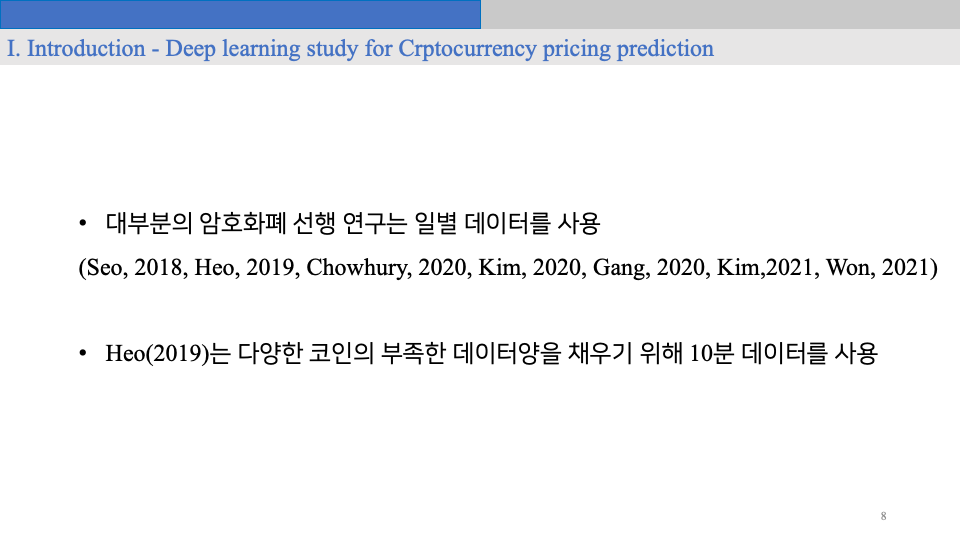
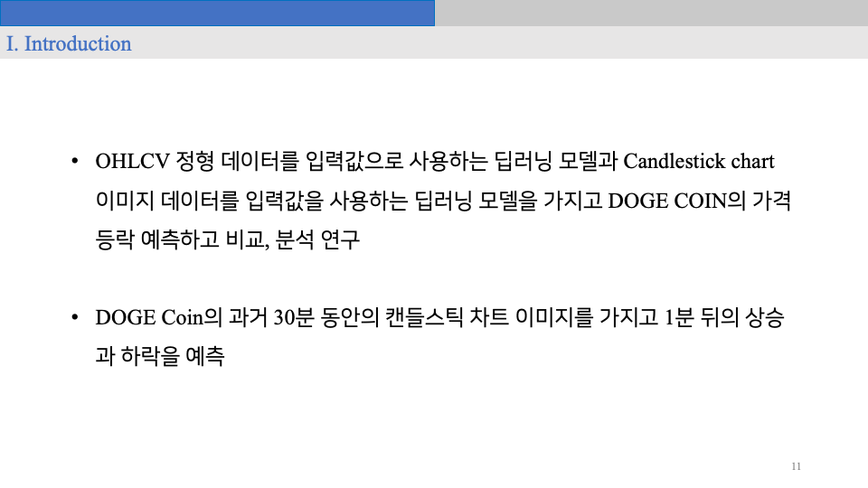
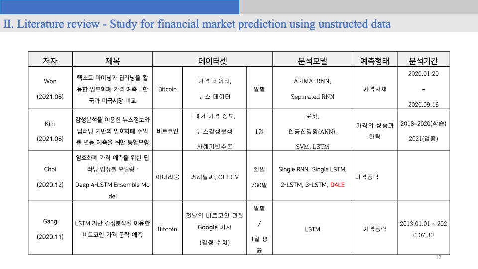
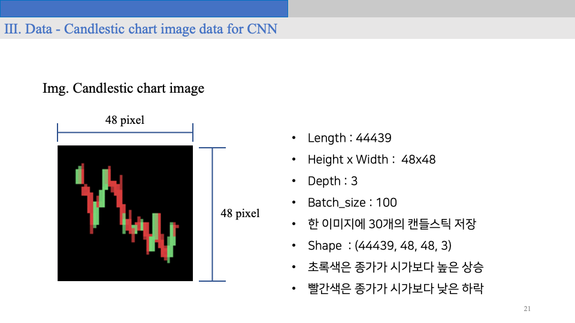
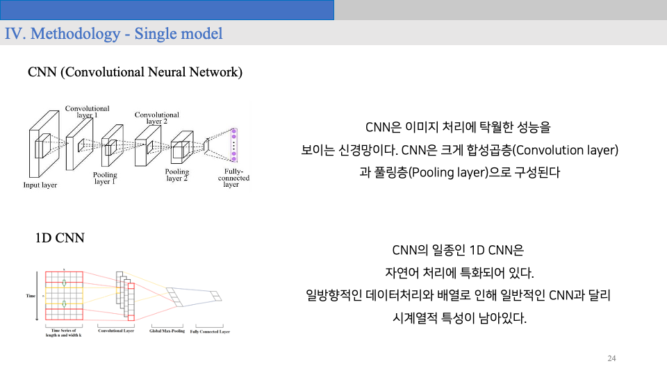
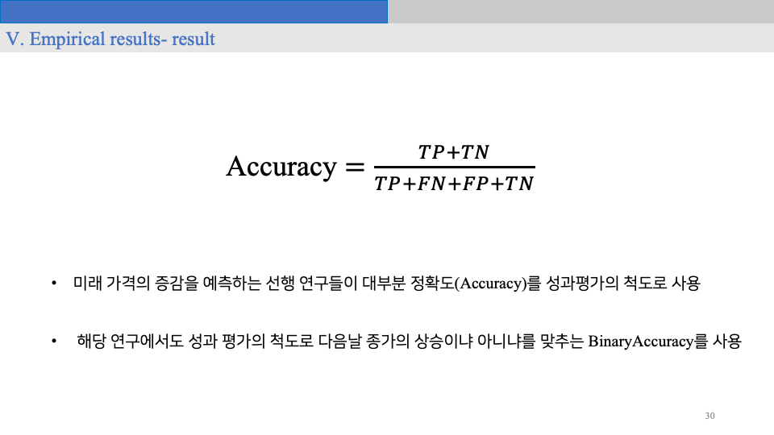
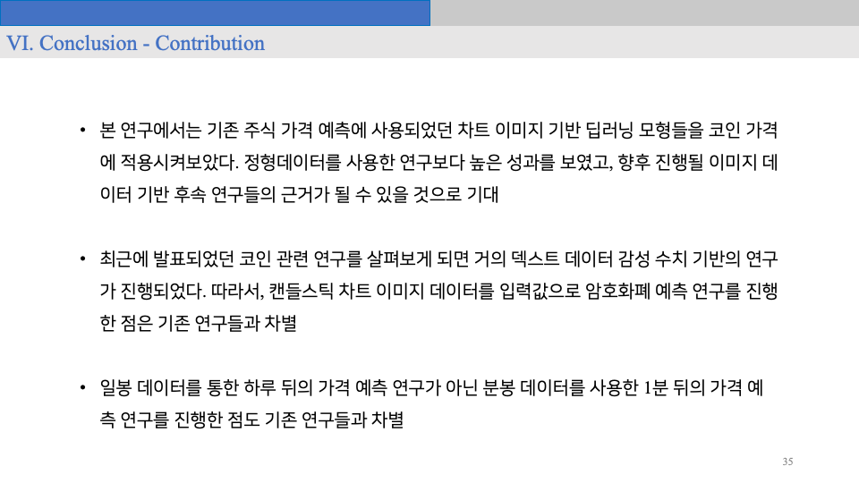

# Deep learning models for Dogecoin price prediction

## 개요

2021학년도 1학기 캡스톤디자인 수업의 결과물로, 2021년 8월 18일에 진행된 한국경영학회 제23회 융합학술대회에서 발표한 프로젝트이다.

이미지 기반의 시계열 AI 모델을 사용하여, 도지코인의 가격을 예측하고자 하였다.

## 팀원
김진우, 안병천

## 발표자료

